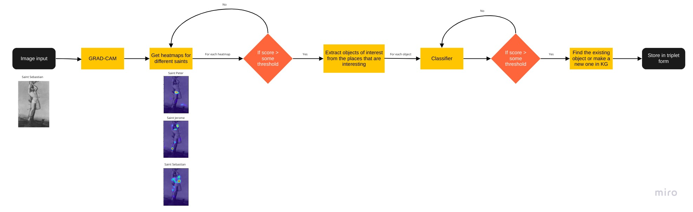
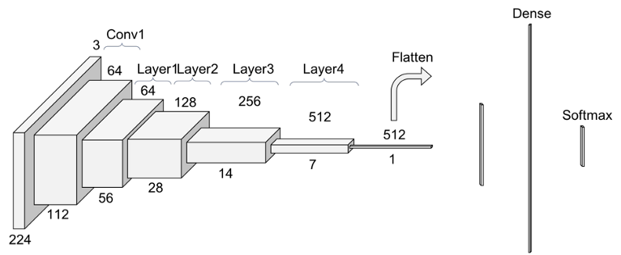
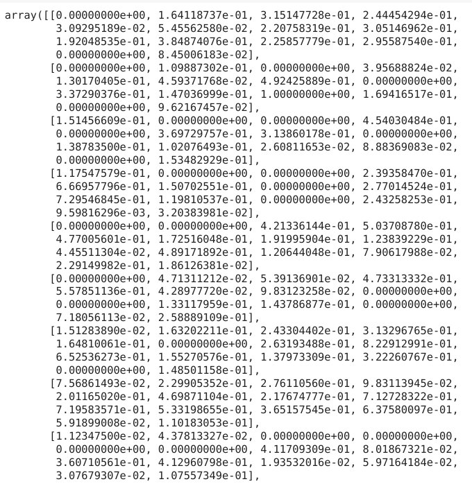
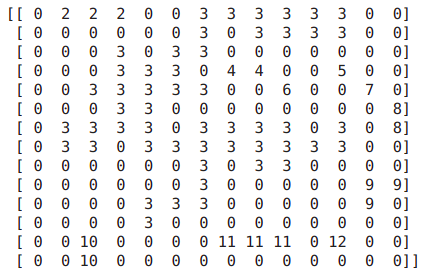
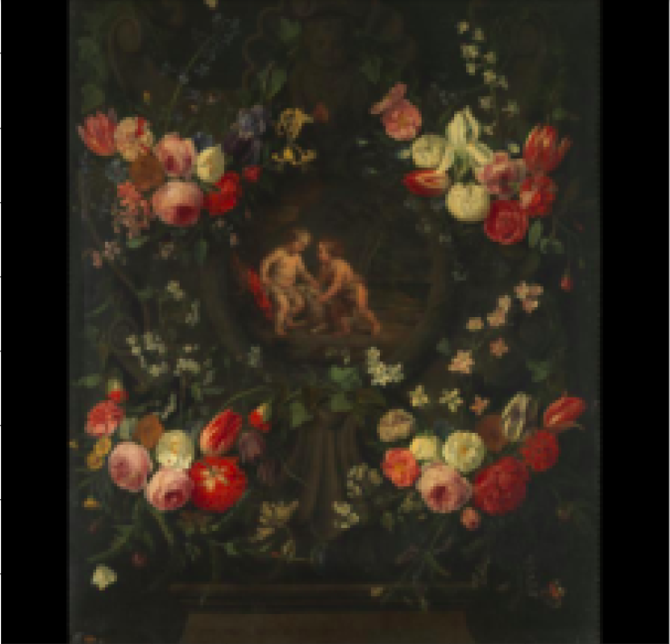
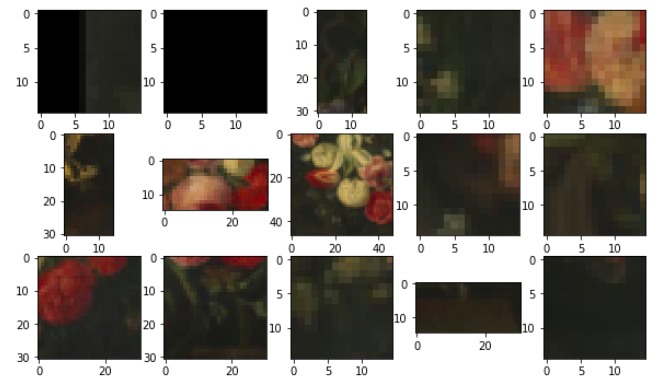

## Welcome to Emile Male Pipeline

This project is developed by Parth Shukla for Google Summer of Code 2022 with Red Hen Lab

### Project Description 
- A knowledge extraction pipeline for artworks from christian iconography that will be used to create a knowledge graph for Christian Iconography. The intention of knowledge graph is that it should help untutored eyes find connections between different artworks. This project is divided into 4 main parts:
1) A model to find the parts of the image that might be useful to us and extract those regions of interest
2) A classification model that would extract possible classes as well as items and use the confidence scores
3) Defining an ontology that would be the skeleton for our knowledge graph. It would be able to tackle the problem of finding connections between separate artworks using the confidence scores found in the previous step
4) Finally, we would populate our knowledge base with the help of our ontology.

## Quick Index of Daily Progress
### Community Bonding Period 
- [Blog Report 1](#blog-report-1) (May 20 ~ Jun 12) 

### Coding Period
- [Blog Report 2](#blog-report-2) (Jun 13 ~ Jun 19)
- [Blog Report 3](#blog-report-3) (Jun 20 ~ Jun 26)
- [Blog Report 4](#blog-report-4) (Jun 27 ~ Jul 3)
- [Blog Report 5](#blog-report-5) (Jul 4 ~ Jul 10)
- [Blog Report 6](#blog-report-6) (Jul 11 ~ Jul 17)
- [Blog Report 7](#blog-report-7) (Jul 18 ~ Jul 24) 

## Community Bonding Period 
### Preparation Stage
- May 23: Finish blog and profile set-up 
- Jun 1: CWRU HPC set-up   
- Jun 3: Inital understanding on Singularity and running a trial singularity on HPC 
- Jun 8: Meet and Greet with Red Hen Lab Mentors and GSoC participants

### Blog Report 1 

#### Part 1: Completed preparation tasks 

The following small tasks have been completed by Jun 12, Sunday. 

- Understand Red Hen Techne Public Site
- Understand how to create Singularity and other information related to Singularity 
- Connected with Rishab, who has a project in the same domain.
- Learnt about Class Activation Maps(Link to get you started - https://towardsdatascience.com/class-activation-mapping-using-transfer-learning-of-resnet50-e8ca7cfd657e)
- Reading of Comparing CAM Algorithms for the Identification of Salient Image Features in Iconography Artwork Analysis by Nicolò Oreste Pinciroli Vago,Federico Milani, Piero Fraternali and Ricardo da Silva Torres. 
- Reading of A Dataset and a Convolutional Model for Iconography Classification in Paintings which presented a huge dataset on Christian Iconography. 
- Preliminary study of Christian Iconography with focus on the saints presented in the ArtDL dataset. Studying what icons are specific to what saints and if there are common elements to different saints. See [Christia Iconography](https://www.christianiconography.info/). For example, Antony Abbot usually has a bell, Saint Peter has 2 keys in his hand. There are also common icons like Lily is representative of Mother Mary as well as Dominic. Similarly, Sword is common for Barbara and Catherine. 

#### Study materials
My study materials and important websites that may be helpful for other student who takes over this project: 

- [Christian Iconography](https://www.christianiconography.info/)

- [Comparison on CAM algorithms](https://www.mdpi.com/2313-433X/7/7/106)

- [ArtDL](http://www.artdl.org/)

- [Deep Learning with PyTorch : GradCAM](https://www.coursera.org/projects/deep-learning-with-pytorch-gradcam)

- [GradCAM with pretrained models](https://medium.com/@stepanulyanin/implementing-grad-cam-in-pytorch-ea0937c31e82)

- [Mother Mary](https://www.encyclopedia.com/religion/encyclopedias-almanacs-transcripts-and-maps/mary-blessed-virgin-iconography)

- [More mother mary](https://www.christianiconography.info/maryPortraits.html)

- [Ontology](https://asistdl.onlinelibrary.wiley.com/doi/pdf/10.1002/bult.283#:~:text=In%20the%20environment%20of%20the,semantic%20information%20across%20automated%20systems.)

- [Protege - Software for ontology](https://protege.stanford.edu/)

- [MusicKG - An interesting read however not esential to pick up the project](https://pdfs.semanticscholar.org/f618/2d5c14c6047d197f1af842862653a13238f2.pdf)

## Coding Period  
### Blog Report 2 
- Coding Period begins  
- Preparation summary before June 13

Before the official coding period, I mainly finished the following preparation works. 
1. Gain a basic understanding of the ArtDL dataset and its classes 
2. Gain a basic understanding of the Christian Iconography 
3. Understanding Class Activation Maps and how they work
4. Decide on CAM algorithm to pursue
5. Literature reading

Some thoughts: 

What, Why and How of the project

What

The purpose of this project is to come up with a pipeline which could imitate Emile Male and act as a learning tool which could help the a beginner just dipping their toes in the ocean of Christian Iconography.

Why

The importance of this pipeline is that it would make Christian Iconography accessible to people who do not have formal education in this field. Especially useful to high-school or college students who do not have a master in this subject guiding them. In the great ocean of Christian Iconography, art pieces are isolated and disconnected, however that is not the intention of the artist. Art is meant to inspired from other pieces of art. I hope to find a way to show that connection in a computational manner.

How

Below, is a high-level Data flow diagonal defining the steps to solve the problem.

Implementation:

I found an extremely useful [article](https://medium.com/@stepanulyanin/implementing-grad-cam-in-pytorch-ea0937c31e82) to understand GRAD-CAM. In order to get good results for our CAM methods we need to train our model on a tagged dataset. Luckily, we have a good dataset prepared by Federico Milani and Piero Fraternalli called the ArtDL. It is available on http://www.artdl.org/. I will use this dataset to train my model. Class Activation Maps(CAM) are extremely useful in helping us understand how a model learns features to distinguish between different classes just as our brain does i.e it observes patterns. Prior to CAM methods, deep learning models were broadly considered to be black boxes and we had to accept the results given by it without understanding what was going on under the hood.

The expected output from this module are bunch of heatmaps for all the classes which have a positive prediction score. Then using these heatmaps, we want to retrieve these objects of interest. This can be done in a way similar to the one explained in https://www.mdpi.com/2313-433X/7/7/106/htm

*The candidate region proposals to use as automatic bounding boxes have been identified with the following heuristic procedure.

- Collect the images on which all the four methods satisfy a minimum quality criterion: for symbol bounding boxes component IoU greater than 0.165 at threshold 0.1 and for whole Saint bounding boxes global IoU greater than 0.24 at threshold 0.05;
- Compute the Grad-CAM class activation map of the selected images and apply the corresponding threshold: 0.1 for symbol bounding boxes and 0.05 for whole Saint bounding boxes;
- Only for symbol boxes: split the class activation maps into connected components. Remove the components whose average activation value is less than half of the average activation value of all components. This step filters out all the foreground pixels with low activation that usually correspond to irrelevant areas;
- For each Iconclass category, draw one bounding box surrounding each component (symbol bounding boxes) and one bounding box surrounding the entire class activation map (whole Saint bounding boxes).*

Even though the method mentioned above is not exactly applicable to my use-case, for example- we do not have ground truth dataset for bounding boxes so we can not use the IoU metric, however it does help me to get an idea about how to go ahead. I recommend checking the Github repository for all the [notebooks](https://github.com/ParthS28/gsoc22-christian-iconography/tree/master/notebooks).

ResNet50 architecture:

If you background information on ResNet, I recommend going through this [article](https://towardsdatascience.com/understanding-and-visualizing-resnets-442284831be8). 

Output of layer 3 gives us a 14x14 matrix whereas layer 4 gives us a 7x7. These matrices are then expanded to 224x224 which is superimposed on the original image to visualise output. An observation was that layer 3 would give more number of regions because there are more discontinuous regions whereas layer 4 being smaller would give lesser number of outputs. 

### Blog Report 3

Goals for this week:
1. Utilise HPC to train models
2. Complete the module which can crop out and extract the regions of interest produced by Grad-CAM for different classes

HPC is something completely new to me. HPC provides us with a tremendous amount of computatinal power and it is important to properly undrstand the capabilities of it while also understanding that it is a shared space and you should not cause any inconvenience to fellow participants. I spent sometime reading up on the techne site to better understand how to schedule tasks. There are two ways to access GPUs i.e interactive job and batch job. I was more comfortable using the batch job. To submit batch jobs you need to submit slurm scripts. I have uploaded my slurm scripts in my repository for anyone stuck in the same position as me. Getting my jobs running on the cluster took some time and I was stuck on it for a few days. Thanks to Dr. Peter Uhrig I was able to figure it out on a scheduled call. After that, I trained my model on the cluster.

Object extractor

If I cosider the results after the layer 3 of ResNet50, I get the following 14x14 matrix(truncated image)

I need to find the connected regions in this matrix. This can be easily solved by applying Depth First Search, similar to "Count the number of island". I also applied a criteria that a cell could only be considered valid if its value was greater than the median of the entire matrix. This would help to ignore foreground pixels.

Intermediate output looks like 

After getting this, we just need to bound an “island” in a box. For example, the island 2 would be bounded by a rectangle covering the columns 2–4 in row 1.

Coordinates for these boxes, once we get, can be easily extrapolated to get the exact pixel location for the object of interest in the image.

For example, Let’s take an example of Mary

Output of the module for Mary

