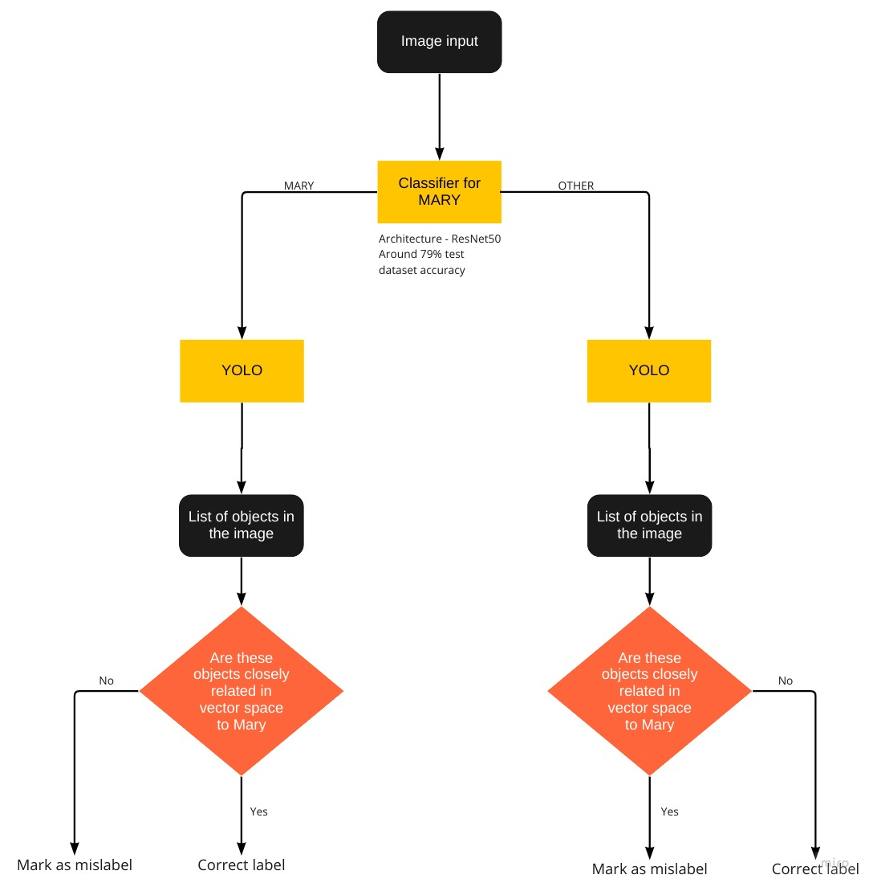
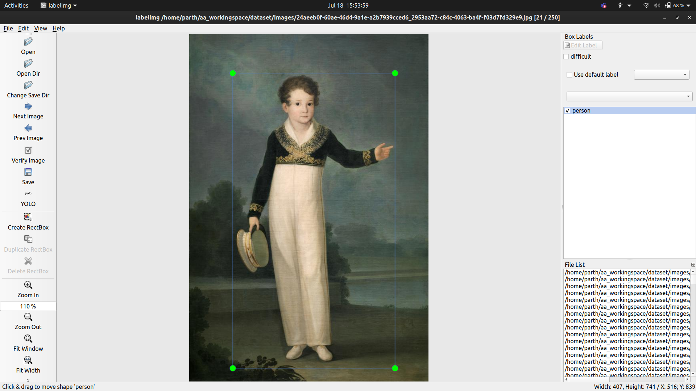

## Welcome to Emile Male Pipeline

This project is developed by Parth Shukla for Google Summer of Code 2022 with Red Hen Lab

### Project Description 
- A knowledge extraction pipeline for artworks from christian iconography that will be used to create a knowledge graph for Christian Iconography. The intention of knowledge graph is that it should help untutored eyes find connections between different artworks. This project is divided into 4 main parts:
1) A model to find the parts of the image that might be useful to us and extract those regions of interest
2) A classification model that would extract possible classes as well as items and use the confidence scores
3) Defining an ontology that would be the skeleton for our knowledge graph. It would be able to tackle the problem of finding connections between separate artworks using the confidence scores found in the previous step
4) Finally, we would populate our knowledge base with the help of our ontology.

## Quick Index of Daily Progress
### Community Bonding Period 
- [Blog Report 1](#blog-report-1) (May 20 ~ Jun 12) 

### Coding Period
- [Blog Report 2](#blog-report-2) (Jun 13 ~ Jun 19)
- [Blog Report 3](#blog-report-3) (Jun 20 ~ Jun 26)
- [Blog Report 4](#blog-report-4) (Jun 27 ~ Jul 3)
- [Blog Report 5](#blog-report-5) (Jul 4 ~ Jul 10)
- [Blog Report 6](#blog-report-6) (Jul 11 ~ Jul 17)
- [Blog Report 7](#blog-report-7) (Jul 18 ~ Jul 24) 

## Community Bonding Period 
### Preparation Stage
- May 23: Finish blog and profile set-up 
- Jun 1: CWRU HPC set-up   
- Jun 3: Inital understanding on Singularity and running a trial singularity on HPC 
- Jun 8: Meet and Greet with Red Hen Lab Mentors and GSoC participants

### Blog Report 1 

#### Part 1: Completed preparation tasks 

The following small tasks have been completed by Jun 12, Sunday. 

- Understand Red Hen Techne Public Site
- Understand how to create Singularity and other information related to Singularity 
- Connected with Rishab, who has a project in the same domain.
- Learnt about Class Activation Maps(Link to get you started - https://towardsdatascience.com/class-activation-mapping-using-transfer-learning-of-resnet50-e8ca7cfd657e)
- Reading of Comparing CAM Algorithms for the Identification of Salient Image Features in Iconography Artwork Analysis by Nicolò Oreste Pinciroli Vago,Federico Milani, Piero Fraternali and Ricardo da Silva Torres. 
- Reading of A Dataset and a Convolutional Model for Iconography Classification in Paintings which presented a huge dataset on Christian Iconography. 
- Preliminary study of Christian Iconography with focus on the saints presented in the ArtDL dataset. Studying what icons are specific to what saints and if there are common elements to different saints. See [Christian Iconography](https://www.christianiconography.info/). For example, Antony Abbot usually has a bell, Saint Peter has 2 keys in his hand. There are also common icons like Lily is representative of Mother Mary as well as Dominic. Similarly, Sword is common for Barbara and Catherine. 

#### Study materials
My study materials and important websites that may be helpful for other student who takes over this project: 

- [Christian Iconography](https://www.christianiconography.info/)

- [Comparison on CAM algorithms](https://www.mdpi.com/2313-433X/7/7/106)

- [ArtDL](http://www.artdl.org/)

- [Deep Learning with PyTorch : GradCAM](https://www.coursera.org/projects/deep-learning-with-pytorch-gradcam)

- [GradCAM with pretrained models](https://medium.com/@stepanulyanin/implementing-grad-cam-in-pytorch-ea0937c31e82)

- [Mother Mary](https://www.encyclopedia.com/religion/encyclopedias-almanacs-transcripts-and-maps/mary-blessed-virgin-iconography)

- [More mother mary](https://www.christianiconography.info/maryPortraits.html)

- [Ontology](https://asistdl.onlinelibrary.wiley.com/doi/pdf/10.1002/bult.283#:~:text=In%20the%20environment%20of%20the,semantic%20information%20across%20automated%20systems.)

- [Protege - Software for ontology](https://protege.stanford.edu/)

- [MusicKG - An interesting read however not esential to pick up the project](https://pdfs.semanticscholar.org/f618/2d5c14c6047d197f1af842862653a13238f2.pdf)

## Coding Period  
### Blog Report 2 
- Coding Period begins  

Before the official coding period, I mainly finished the following preparation works. 
1. Gain a basic understanding of the ArtDL dataset and its classes 
2. Gain a basic understanding of the Christian Iconography 
3. Understanding Class Activation Maps and how they work
4. Decide on CAM algorithm to pursue
5. Literature reading

Some thoughts: 

What, Why and How of the project

What

The purpose of this project is to come up with a pipeline which could imitate Emile Male and act as a learning tool which could help the a beginner just dipping their toes in the ocean of Christian Iconography.

Why

The importance of this pipeline is that it would make Christian Iconography accessible to people who do not have formal education in this field. Especially useful to high-school or college students who do not have a master in this subject guiding them. In the great ocean of Christian Iconography, art pieces are isolated and disconnected, however that is not the intention of the artist. Art is meant to inspired from other pieces of art. I hope to find a way to show that connection in a computational manner.

How

Below, is a high-level Data flow diagonal defining the steps to solve the problem.

Implementation:

I found an extremely useful [article](https://medium.com/@stepanulyanin/implementing-grad-cam-in-pytorch-ea0937c31e82) to understand GRAD-CAM. In order to get good results for our CAM methods we need to train our model on a tagged dataset. Luckily, we have a good dataset prepared by Federico Milani and Piero Fraternalli called the ArtDL. It is available on http://www.artdl.org/. I will use this dataset to train my model. Class Activation Maps(CAM) are extremely useful in helping us understand how a model learns features to distinguish between different classes just as our brain does i.e it observes patterns. Prior to CAM methods, deep learning models were broadly considered to be black boxes and we had to accept the results given by it without understanding what was going on under the hood.

The expected output from this module are bunch of heatmaps for all the classes which have a positive prediction score. Then using these heatmaps, we want to retrieve these objects of interest. This can be done in a way similar to the one explained in https://www.mdpi.com/2313-433X/7/7/106/htm

*The candidate region proposals to use as automatic bounding boxes have been identified with the following heuristic procedure.*

- *Collect the images on which all the four methods satisfy a minimum quality criterion: for symbol bounding boxes component IoU greater than 0.165 at threshold 0.1 and for whole Saint bounding boxes global IoU greater than 0.24 at threshold 0.05;*
- *Compute the Grad-CAM class activation map of the selected images and apply the corresponding threshold: 0.1 for symbol bounding boxes and 0.05 for whole Saint bounding boxes;*
- *Only for symbol boxes: split the class activation maps into connected components. Remove the components whose average activation value is less than half of the average activation value of all components. This step filters out all the foreground pixels with low activation that usually correspond to irrelevant areas;*
- *For each Iconclass category, draw one bounding box surrounding each component (symbol bounding boxes) and one bounding box surrounding the entire class activation map (whole Saint bounding boxes).*

Even though the method mentioned above is not exactly applicable to my use-case, for example- we do not have ground truth dataset for bounding boxes so we can not use the IoU metric, however it does help me to get an idea about how to go ahead. I recommend checking the Github repository for all the [notebooks](https://github.com/ParthS28/gsoc22-christian-iconography/tree/master/notebooks).

ResNet50 architecture:

If you background information on ResNet, I recommend going through this [article](https://towardsdatascience.com/understanding-and-visualizing-resnets-442284831be8). 

Output of layer 3 gives us a 14x14 matrix whereas layer 4 gives us a 7x7. These matrices are then expanded to 224x224 which is superimposed on the original image to visualise output. An observation was that layer 3 would give more number of regions because there are more discontinuous regions whereas layer 4 being smaller would give lesser number of outputs. 

### Blog Report 3

Goals for this week:
1. Utilise HPC to train models
2. Complete the module which can crop out and extract the regions of interest produced by Grad-CAM for different classes

HPC is something completely new to me. HPC provides us with a tremendous amount of computatinal power and it is important to properly undrstand the capabilities of it while also understanding that it is a shared space and you should not cause any inconvenience to fellow participants. I spent sometime reading up on the techne site to better understand how to schedule tasks. There are two ways to access GPUs i.e interactive job and batch job. I was more comfortable using the batch job. To submit batch jobs you need to submit slurm scripts. I have uploaded my slurm scripts in my repository for anyone stuck in the same position as me. Getting my jobs running on the cluster took some time and I was stuck on it for a few days. Thanks to Dr. Peter Uhrig I was able to figure it out on a scheduled call. After that, I trained my model on the cluster.

Object extractor

If I cosider the results after the layer 3 of ResNet50, I get the following 14x14 matrix(truncated image)

I need to find the connected regions in this matrix. This can be easily solved by applying Depth First Search, similar to "Count the number of island". I also applied a criteria that a cell could only be considered valid if its value was greater than the median of the entire matrix. This would help to ignore foreground pixels.

Intermediate output looks like 

After getting this, we just need to bound an “island” in a box. For example, the island 2 would be bounded by a rectangle covering the columns 2–4 in row 1.

Coordinates for these boxes, once we get, can be easily extrapolated to get the exact pixel location for the object of interest in the image.

For example, Let’s take an example of Mary

Output of the module for Mary

### Blog Report 4

Goals for this week
- Putting all of the work done till now together
- Research on EfficientNet as a method for the second module

I compiled all the code and put it al together so that I could run it on the cluster and get the results back on my computer to observe. The data used for this part was test data i.e data previously unseen by the model. 

Difficulties

1. Storing the meta-data for the extracted objects.
2. Nomenclature of the extracted images should be consistent as the they are huge in number(for example, can have 170 regions of interest for all the classes combined, if not more, now considering only the test dataset which is roughly 4000 pieces of art, we could be dealing with storing 170*4000=680,000 images).
3. Not all of these 680,000 images are useful entities, there is a possibility that it may only contain background pixels not representing anything of substance. This problem would be tackled in the next part of our pipeline.
4. The huge amount of images being produced were difficult to work with.

Solutions

1. I stored the metadata in this format for now

Columns - object_id, item(basically Image name, consistent with ArtDL), associated_class(which is the class for which the object was generated) and actual_class(which is the class it belongs to according to ArtDL).

4. One method to reduce number of images was if I took output for layer 4 instead of layer 3 of my ResNet50 model as it would privide a 7x7 matrix.

So where are we now?

And this is how images look like

In order to make sense of these extracted images, I wanted to train a classifier on a dataset of images of some popular symbols of iconography eg, Baby(for baby jesus),Book,Key,Flowers,Cross,Ointment jar,Arrow,Bird,Sword,Dog. I tried EfficientNet architecture to do so, here is [the notebook](https://github.com/ParthS28/gsoc22-christian-iconography/blob/master/notebooks/EfficientNet_training.ipynb) for it. However, the results were not promising on the extracted objects. My theory behind why it might not be performing well: 1) Training data was not translating well to the testing data maybe because the testing data was way more than training data 2) Curated dataset on which the  model was trained was not good enough 3) Testing data may be too dissimilar to training data.

**Meeting**

Sharing my result and progress on the call, I was adviced to try to focus on Mother Mary and see how the results are. Build in a modular way so that it is possible to expand the pipeline going forward. This change makes sense as well since the dataset I am using has around 60% examples of Mary.

So based on this I modified my approach a little. 

### Blog Report 5

Goals
1. Modify pipeline to accomodate the change mentioned above
2. Re-training ResNet50 from the first module
3. Getting the extracted objects similar to the outputs you see above but with the new model only for MARY

My modified pipeline looked something like this
.jpg)

The main change from the previous approach is that, the system first tries to decide if art is of Mary

1. If it is Mary, extracts the object using CAM and stores its instance
2. If it is not Mary, extracts objects using CAM for Mary and stores its instance

But why do we need this change?

Let’s say we have an image tagged with the label St. Sebastian. However, when the artist was painting this, they were told to also include a Pear in the painting. Pear is an important symbol for Mother Mary as it shows the sweetness of her soul. Artist included this to give associate Mother Mary to the scene depicted in the painting.

Our first module will be able to classify this image as OTHER i.e not related to Mary, however there still are elements to Mary in this, for example the Pear. When we pass this image through our first module. We get the output of a cropped image of the pear with the metadata saying that the pear represents Mother Mary. This information will then need to be ingested into our Knowledge Graph.

Implementation

To implement this, I had to change the way I was passing the training data to model. If the image was of Mary, I was passing the label 0 and if it was any other saint then I would pass the label 1. Training ResNet50 for only a few epochs I was able to achieve ~81 percent testing accuracy. In additon to these changes, I also freeze first two blocks of ResNet50 which showed an increase in performance.

For getting the output this time, I decided to utilise the layer 4 of ResNet because of the reason I mentioned a few pages up, the amount of outputs I got from layer 3 were huge and inpossible to observe and were redundant too.

The metadata file for outputs looks like this

Explanation - First row has the object_id out0_0_0.png, this means it is output of first image in the testing dataset and the current label for it 0(MARY) and it is the first object extracted in this image.

First number - index number in the testing dataset

Second Number - Class number i.e 0 for MARY and 1 for OTHER

Third Number - Counter for number of instances produced for that particular image and class

### Blog Report 6

Goals
1. Find methods to create embeddings using Iconography texts

#### Monday

Further reading of material on Mary and making a note of her symbols like Crown, Lilies, Mystic [or Mystical] Rose, Iris, Pear, Fleur-de-lys(?), Baby Jesus, Rosary, Stars(from crown of stars), Blue robe, Crescent - because of immaculate conception, Granada. Collected a few images on these items and ran EfficientNet.

- Mentor meeting

Continued discussion of the scope of the project with Prof. Mark Turner and Tiago Torrent. Format of blog was also discussed. Tiago mentioned some ideas using the large corpora of christian iconography texts available. Some possibilities like texts can be used to generate a domain for christian iconography, also examples of how caption generation techniques can be used to help image tagging. 

- Ideas after the meeting
1. See how to utilise textual data to create embeddings 
2. Look into auxillary learning
3. Find previous relevant computer vision work in Iconclass for indicators

- Problems I'm still not sure how to solve
How to use Computer Vision for these images to utilise the embeddings. Maybe use YOLOv6 on images and then each instance can become a relationship between the two objects and then the embeddings can help me in tagging the image.

#### Tuesday

- Restructuring the blog similar to the style followed by Wenyue Xi (Suzie) for Google Summer of Code 2020 for [their project](https://suziexi.github.io/frameblends.github.io/). Reason - previously I was only blogging results and decisions, however it is also important to document all the challenges faced in the process because other people will certainly face difficulties and this would help them understand how my project progressed and why I did certain things and how they could build on it and don't struggle on the same step.  
- Read up on Auxillary Learning. Highly recommend going through [this article](https://vivien000.github.io/blog/journal/learning-though-auxiliary_tasks.html) for it. 

#### Wednesday

Looking into ways to create embeddings. According to wiki, Word embedding is the collective name for a set of language modeling and feature learning techniques in natural language processing (NLP) where words or phrases from the vocabulary are mapped to vectors of real numbers. One of the most common example for learning embeddings are word2vec. I have worked with word2vec before, mostly using GloVe, however I have never learnt embeddings from scratch. There is a good [article](https://towardsdatascience.com/creating-word-embeddings-coding-the-word2vec-algorithm-in-python-using-deep-learning-b337d0ba17a8) on it. 

Results: 

Words in close association to Mary

There is more scope to this method because we can see 'lorenzettis' who is a painter, 'crucifixion', 'heaven' and 'child' in closeness to Mary but there is more need for data cleaning and selecting the right type texts so that more relevant symbols can be close to Mary. 

#### Thursday 

- Learnt further about embeddings. [link](https://www.featureform.com/post/the-definitive-guide-to-embeddings)
- Another great [article](http://mccormickml.com/2016/04/19/word2vec-tutorial-the-skip-gram-model/) on Word2Vec.
- [Towards Generating and Evaluating Iconographic Image Captions of Artworks](https://pubmed.ncbi.nlm.nih.gov/34460759/)
- [Multi-modal Label Retrieval for the Visual Arts: The Case of Iconclass](https://www.scitepress.org/Papers/2021/103906/103906.pdf)
- [Iconclass image captioning](https://github.com/EvaCet/Iconclass-image-captioning)

In order to leverage Word2Vec embeddings, I have come up with a possible solution that could help us confirm our tags and also change tags if confident enough. It is based on something Tiago Torrent mentioned on the class where we can utilise textual data to create embeddings and those embeddings help us tag image or even correct images. These methods are very popular incaption generation tasks.

The "Mark as mislabel" in the classifier can be used to change the label as well if the confidence score received by using the embeddings are confident enough.

Problems in this technique:
- The embeddings need to be more representative, this would require more cleaning of textual data and also adding more sources. I am looking into this.
- There are no datasets or models that can generalise well enough for the task which is to be done by YOLO. I will have manually define what symbols to target and tag some current artworks to train YOLO.

#### Friday

- Learnt about [YOLO](https://machinelearningknowledge.ai/yolov6-explained-with-tutorial-and-example/)
- Plan on how to utilise captions from [here](https://github.com/EvaCet/Iconclass-image-captioning) using [Iconclass AI test set](https://labs.brill.com/ictestset/). Iconclass AI test set has a json file which contains image filenames with associated Iconclass categorisation. For now, since our scope is limited to MARY we can utilise all the filenames with classes starting with "11F" and search for their captions on the [github repo](https://github.com/EvaCet/Iconclass-image-captioning). 
- Discussion with Rishab on how to integrate our projects. 
- Try different texts for Word2Vec.

### Blog Report 7

Goals-
- Create embeddings and utilise them 
- Train YOLO on a dataset with annotations for Christian Iconoraphy. This process would would require me to curate a dataset and annotate them and followed by training.

#### Monday

- Tried training Word2Vec on HPC, however ran into trouble relatin to versioning so will continue trying to fix that.
- Began the process of curating a dataset for training YOLO. Tagged a hundred images belonging to Mary with objects such as baby, person, angel, book, jar, crown etc. In a lot of the images, we have mary depicted as a maiden with a baby on lap or on her arms. However, some of the artwork really stands out in their potrayal of Mary.

Current version of the dataset: [link](https://drive.google.com/file/d/1nj8mDtV73DsbA-i_J2R2Irb1Mda0eqcj/view?usp=sharing)

Some generalizations I have made during tagging: It is tough to distinuguish between halo and a crown and both of them rest at the top of the head, so I have tagged them under the same label. Jar - Jar is for ointment jar which is common for Mary Magdalene, but still appears in Mother Mary so I have tagged them and moving forward we can see if they turn out to be useful.

This is a Mary image with a lot going on. There are instances of Person, Crown, Bird, Angels. 

In this mary is represented as a kid with a person, who I can only assume to be Joachim because of age difference and their potrayal, this would deceive our classifier which is used to seeing a baby and a lady in a picture so call it Mary.

In this Mary is represented as a kid, however I'm not sure why this style has been applied

Another potrayal of slightly older Mary, praying in front of a book. Again, it does not contain the repetitive features that we observe and could fool the anyone.

Marriage of Mary and Joseph. This one in particular is also different in style to the others.
